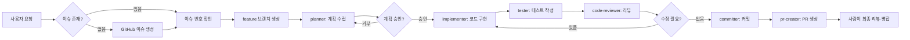

# AGENTS.md

**Ramap 프로젝트의 AI Agent 오케스트레이션 정책**

이 문서는 AI 개발 도구(Claude Code, Cursor, Windsurf 등)가 Ramap 프로젝트에서 작업할 때 따라야 할 최상위 규칙입니다.

---

## ⚠️ 핵심 원칙: 절대 혼자 작업하지 않기

**AI는 절대로 혼자서 코드를 작성하지 않습니다.**

모든 작업은 전문화된 Agent에게 위임합니다. 이 규칙은 사용하는 AI 모델(Claude, GPT, Gemini 등)과 관계없이 동일하게 적용됩니다.

### 정책 우선순위
1. 사용자 명시적 요청
2. 이 문서(AGENTS.md)와 `wiki/operations/` 규칙
3. 각 Agent 파일(`.codex/agents/*`)의 세부 지침

---

## 🎯 빠른 참조: Agent 라우팅 테이블

| 사용자 요청 | 담당 Agent | 설명 |
|------------|-----------|------|
| "찾아줘", "어디에", "탐색" | `explore` | 파일/코드 탐색 (READ-ONLY) |
| "문서 작성", "README 업데이트" | `writer` | 문서 작성 |
| "계획", "어떻게 구현", "설계" | `planner` | 구현 계획 수립 (READ-ONLY) |
| "구현", "만들어", "추가", "수정" | `implementer` | 실제 코드 작성 |
| "테스트", "테스트 코드" | `tester` | 테스트 작성 |
| "리뷰", "검토" | `code-reviewer` | 코드 리뷰 (READ-ONLY) |
| "커밋", "변경사항 저장" | `committer` | Git 커밋 생성 |
| "PR", "Pull Request" | `pr-creator` | PR 생성 및 push |
| "커밋하고 PR까지", "commit/push/PR", "/ship" | `committer` → `pr-creator` | 커밋, push, Draft PR 생성 통합 실행 |

**상세 라우팅 규칙**: `wiki/operations/routing-rules.md`

---

## 📋 작업 워크플로우

### 표준 워크플로우 (이슈 기반)



### 워크플로우 단계별 설명

#### 1. 이슈 생성 (필수)
```bash
# AI가 자동으로 실행
gh issue create --title "feat: 지도에 라멘집 마커 표시" \
  --body "사용자가 지도에서 라멘집 위치를 볼 수 있어야 합니다." \
  --label "feature"
```

**규칙**:
- 모든 작업은 GitHub 이슈로 시작
- 이슈 제목은 Conventional Commits 형식
- 이슈 제목과 본문은 한국어로 작성 (type/scope는 Conventional Commits 표기를 위해 영어 허용)
- 라벨: feature, bug, docs, refactor, test

#### 2. 브랜치 생성
```bash
# AI가 자동으로 실행
git checkout develop
git pull origin develop
git checkout -b feature/123-add-shop-markers
```

**브랜치 네이밍**:
- `feature/<issue-number>-<kebab-case-description>`
- `fix/<issue-number>-<description>`
- `docs/<issue-number>-<description>`

#### 3. 계획 수립 (planner)
- READ-ONLY Agent
- 구현 계획 작성
- 영향 받는 파일 목록
- 테스트 전략

**출력**: `계획 문서` → 사용자 승인 필요

#### 4. 구현 (implementer)
- 계획 승인 후 실행
- Next.js/React Native 코드 작성
- 타입 안정성 보장

#### 5. 테스트 (tester)
- Jest/React Testing Library 사용
- 최소 핵심 경로 테스트
- 회귀 방지

#### 6. 리뷰 (code-reviewer)
- READ-ONLY Agent
- 코딩 컨벤션 확인
- 잠재적 버그 탐지
- 개선 제안

#### 7. 커밋 (committer)
- Conventional Commits 준수
- 커밋 메시지는 한국어로 작성 (type/scope는 Conventional Commits 표기를 위해 영어 허용)
- 사용자 승인 필요 (명시적 "커밋해줘" 요청 시 자동 승인)

#### 8. PR 생성 (pr-creator)
- Draft PR 자동 생성
- PR 제목과 본문은 한국어로 작성
- PR 본문에는 `## Verification` 섹션과 검증 명령어 체크리스트를 작성하지 않음
- 사용자 승인 필요 (명시적 "PR 만들어줘" 또는 통합 요청 시 자동 승인)
- develop 브랜치로 병합 요청

#### 9. 통합 실행 (committer → pr-creator)
- 명시적 통합 요청이 있으면 `committer` 이후 `pr-creator`까지 연속 실행
- 예: "커밋하고 PR까지", "commit/push/PR 해줘", `/ship`
- 커밋 생성, 원격 브랜치 push, Draft PR 생성은 통합 요청으로 승인된 것으로 간주
- PR 병합은 자동 실행하지 않으며 사람이 최종 리뷰 후 병합

---

## 🔑 핵심 운영 원칙

### 1. 의도 우선 라우팅
키워드만 보지 말고 **사용자의 실제 의도**를 파악합니다.

**예시**:
- "지도 기능 어디 있어?" → `explore` (탐색 의도)
- "지도에 마커 추가해줘" → `planner` → `implementer` (구현 의도)
- "지도 코드 리뷰해줘" → `code-reviewer` (검토 의도)

### 2. 단일 Owner 원칙
- 하나의 작업은 하나의 Agent가 담당
- 작업 완료 후 다음 Agent로 넘김
- Agent 간 중복 작업 금지

### 3. 승인 게이트

| 작업 유형 | 승인 필요 여부 | 설명 |
|----------|--------------|------|
| 계획 수립 | ✅ 필요 | 모호하거나 큰 작업만 |
| 코드 구현 | ⚠️ 조건부 | 명확한 "구현해줘" 요청은 자동 승인 |
| 커밋 생성 | ✅ 필요 | 명시적 "커밋해줘" 요청 시 자동 |
| push 및 PR 생성 | ✅ 필요 | 명시적 "PR 만들어줘" 또는 통합 요청 시 자동 |
| 통합 실행 | ✅ 필요 | "커밋하고 PR까지", "commit/push/PR 해줘", `/ship` 요청 시 커밋 → push → Draft PR 생성 자동 |
| PR 병합 | ✅ 필수 | **AI는 절대 병합하지 않음** |

**명확한 구현 요청 예시** (자동 승인):
- "지도 컴포넌트 만들어줘"
- "리뷰 작성 폼 추가해줘"
- "이 버그 고쳐줘"

**계획 필요 예시** (승인 필요):
- "지도 기능 추가해줘" (범위 모호)
- "성능 개선해줘" (접근 방법 다양)
- "아키텍처 리팩토링해줘" (영향 범위 큼)

### 4. 병렬 작업 원칙

**병렬 실행 가능**:
- 서로 다른 feature 모듈
- 독립적인 컴포넌트
- 의존성 없는 파일

**병렬 실행 금지**:
- 같은 파일 수정
- 의존 관계가 있는 모듈
- 순차적 작업 (A → B → C)

### 5. 도메인 용어 기준
- 프로젝트 공식 용어: `wiki/reference/domain-glossary.md`
- 코드, 커밋 메시지, PR에서 일관된 용어 사용
- 임의 용어 생성 금지 → 불명확하면 사용자에게 확인

**Ramap 핵심 도메인 용어**:
- **Shop**: 라멘 가게
- **Review**: 사용자 리뷰 (별점, 내용, 사진)
- **Checkin**: 방문 기록
- **Location**: 위도/경도 좌표

### 6. 작은 작업 예외
아주 작은 수정은 오버헤드를 줄입니다.

- 파일 1~2개, 10줄 이하 수정: 이슈/브랜치 생략 가능
- 오타 수정, 문서 업데이트: planner 생략 가능
- **단, 커밋/push/PR은 명시적 개별 요청 또는 통합 요청이 있을 때만 실행**

---

## 🛠️ LLM 모델 중립성

이 Agent 시스템은 **모든 AI 모델과 도구**에서 동일하게 작동합니다.

### 지원하는 AI 환경
- ✅ Claude Code (Claude Sonnet/Opus)
- ✅ Cursor (GPT-4, Claude)
- ✅ Windsurf (Cascade)
- ✅ GitHub Copilot Chat
- ✅ 기타 모든 AI 코딩 도구

### 모델 중립적 작동 원리
1. **공통 역할 문서**: Canonical Agent 정의는 `.codex/agents/tier1/*.md`, `.codex/agents/tier2/*.md` 파일
2. **범용 CLI 명령어**: git, gh, pnpm 등 표준 도구
3. **명시적 프롬프트**: 모델별 API가 아닌 자연어 지침
4. **도구별 어댑터**: Codex는 `.codex/agents/*.toml`, Claude Code는 `.claude/agents/*.md` 사용
5. **도구 독립적**: 특정 IDE 기능에 의존하지 않음

### Tool-specific Subagent Adapters

Ramap Agent 역할은 하나이며, 도구별 파일은 같은 역할 문서를 가리키는 얇은 어댑터입니다.

| 도구 | 네이티브 위치 | 기준 역할 문서 |
|------|---------------|----------------|
| Codex | `.codex/agents/<agent>.toml` | `.codex/agents/tier1/*.md`, `.codex/agents/tier2/*.md` |
| Claude Code | `.claude/agents/<agent>.md` | `.codex/agents/tier1/*.md`, `.codex/agents/tier2/*.md` |

**규칙**:
- 새 역할을 추가할 때는 먼저 기준 역할 문서를 작성합니다.
- Codex/Claude 어댑터는 역할 요약, 트리거 설명, 도구 권한, 기준 문서 경로만 포함합니다.
- 역할 정책을 변경할 때는 기준 역할 문서를 먼저 수정하고 어댑터에는 필요한 최소 변경만 반영합니다.

### Agent 호출 방법 (모델 무관)
```
사용자: "지도 컴포넌트 구현해줘"

AI 판단:
1. 의도 파악: 구현 요청
2. Agent 선택: planner → implementer
3. 실행: .codex/agents/tier2/planner.md 지침 따름
```

---

## 📚 참고 문서

### 필수 문서
| 문서 | 경로 | 용도 |
|------|------|------|
| 프로젝트 개요 | `README.md` | Ramap 소개, 기술 스택 |
| 기여 가이드 | `CONTRIBUTING.md` | Git Flow, 커밋 컨벤션 |
| 도메인 용어집 | `wiki/reference/domain-glossary.md` | 공식 용어 정의 |
| 라우팅 규칙 | `wiki/operations/routing-rules.md` | Agent 선택 기준 |
| 워크플로우 | `wiki/operations/workflows.md` | 작업 절차 상세 |

### Agent 정의 파일
| Tier | Agent | 파일 | 역할 |
|------|-------|------|------|
| 1 | explore | `.codex/agents/tier1/explore.md` | 코드 탐색 (READ-ONLY) |
| 1 | writer | `.codex/agents/tier1/writer.md` | 문서 작성 |
| 2 | planner | `.codex/agents/tier2/planner.md` | 계획 수립 (READ-ONLY) |
| 2 | implementer | `.codex/agents/tier2/implementer.md` | 코드 구현 |
| 2 | tester | `.codex/agents/tier2/tester.md` | 테스트 작성 |
| 2 | code-reviewer | `.codex/agents/tier2/code-reviewer.md` | 코드 리뷰 (READ-ONLY) |
| 2 | committer | `.codex/agents/tier2/committer.md` | Git 커밋 |
| 2 | pr-creator | `.codex/agents/tier2/pr-creator.md` | PR 생성 |

**Tier 구분**:
- **Tier 1**: 빠르고 가벼운 작업 (탐색, 문서화)
- **Tier 2**: 복잡한 작업 (구현, 테스트, 리뷰)

---

## 🎬 Quick Start: 첫 작업 예시

### 시나리오: "지도에 라멘집 마커 표시 기능 추가"

```bash
# 사용자: "지도에 라멘집 마커를 표시해줘"

# 1. AI가 이슈 생성
gh issue create --title "feat(map): 지도에 라멘집 마커 표시" \
  --body "사용자가 지도에서 라멘집 위치를 볼 수 있어야 합니다." \
  --label "feature"
# 생성된 이슈: #42

# 2. 브랜치 생성
git checkout -b feature/42-add-shop-markers

# 3. planner 실행 (READ-ONLY)
# 출력: 구현 계획 (파일 목록, 데이터 흐름, 테스트 전략)

# 사용자: "계획 승인합니다"

# 4. implementer 실행
# - apps/web/app/map/components/ShopMarkers.tsx 생성
# - packages/shared/src/api/shops.ts 수정

# 5. tester 실행
# - apps/web/app/map/components/ShopMarkers.test.tsx 생성

# 6. code-reviewer 실행 (READ-ONLY)
# 출력: 리뷰 의견

# 7. 사용자: "커밋하고 PR까지 해줘"
# committer 실행
# 원격 브랜치 push
# pr-creator 실행
# Draft PR 생성: https://github.com/chanho0908/Ramap/pull/43

# 8. 사용자가 GitHub에서 최종 리뷰 후 병합
```

---

## 📌 Quick Commands

```bash
/explore <query>   # 코드 탐색
/plan             # 계획 수립
/impl             # 계획 → 구현 → 테스트 일괄 실행
/commit           # 커밋 생성
/pr               # PR 생성
/ship             # 커밋 → push → Draft PR 생성 통합 실행
/review           # 코드 리뷰
```

---

## 🔒 안전 원칙

1. **AI는 PR을 자동으로 병합하지 않습니다**
2. **민감 정보(토큰, 비밀번호)를 코드에 포함하지 않습니다**
3. **파괴적 변경은 항상 사용자 승인을 받습니다**
4. **테스트 없는 코드는 커밋하지 않습니다**
5. **도메인 지식이 불확실하면 사용자에게 확인합니다**

---

## 📞 문의 및 개선

- Agent 동작 이상: GitHub Issues에 `label: agent` 추가
- 새 Agent 제안: `wiki/inbox/` 에 제안서 작성
- 워크플로우 개선: `wiki/operations/workflows.md` 수정 PR

---

**버전**: 1.0.0
**최종 업데이트**: 2026-06-20
**작성자**: Ramap Team
**라이선스**: MIT
