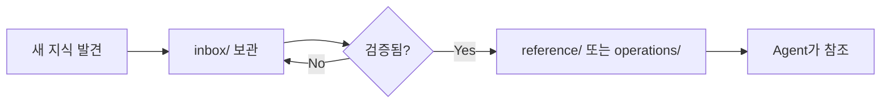

# Ramap Wiki

**Ramap 프로젝트의 공식 지식 베이스**

이 Wiki는 프로젝트의 모든 공식 지식을 체계적으로 관리합니다.

---

## 📖 빠른 시작

| 궁금한 내용 | 문서 |
|-----------|------|
| 프로젝트 소개 | [README.md](../README.md) |
| 개발 가이드 | [CONTRIBUTING.md](../CONTRIBUTING.md) |
| Agent 시스템 | [AGENTS.md](../AGENTS.md) |
| 도메인 용어 | [domain-glossary.md](reference/domain-glossary.md) |
| 개발 워크플로우 | [workflows.md](operations/workflows.md) |

---

## 📚 문서 구조

### 🔷 reference/ - 기술 참고 문서
프로젝트의 핵심 기술 지식

- [domain-glossary.md](reference/domain-glossary.md) - 도메인 용어집
- [architecture.md](reference/architecture.md) - 시스템 아키텍처
- [api-guide.md](reference/api-guide.md) - API 사용 가이드

### 🔶 operations/ - 작업 절차
개발 프로세스와 운영 규칙

- [workflows.md](operations/workflows.md) - 개발 워크플로우
- [routing-rules.md](operations/routing-rules.md) - Agent 라우팅 규칙
- [add-shop-to-supabase.md](operations/add-shop-to-supabase.md) - Kakao Map 매장 Supabase 추가 절차
- [deployment.md](operations/deployment.md) - 배포 가이드

### 🔸 schema/ - Wiki 운영 규칙
Wiki 자체의 관리 방법

- [workflow.md](schema/workflow.md) - Wiki 운영 흐름
- [maintenance.md](schema/maintenance.md) - 유지보수 규칙

### 📝 templates/ - 문서 템플릿
새 문서 작성 시 사용

- [feature-spec.md](templates/feature-spec.md) - 기능 명세서
- [adr.md](templates/adr.md) - Architecture Decision Record

### 📥 inbox/ - 임시 지식 저장소
검증 전 자료 보관

- 새로운 패턴 발견 시 임시 보관
- 검증 후 공식 Wiki로 승격

### 📋 decisions/ - 의사결정 기록
중요한 기술 결정 히스토리

- ADR (Architecture Decision Records)
- 설계 변경 이력

---

## 🏷️ Authority 레벨

각 문서의 신뢰도를 표시합니다.

| 레벨 | 의미 | 사용 |
|------|------|------|
| `canonical` | 검증된 공식 기준 | 프로젝트 사실과 정책의 근거 |
| `synthesized` | 공식 문서 기반 해설 | 이해를 돕는 가이드 |
| `none` | 비공식 자료 | 참고만, 근거로 사용 불가 |

**예시**:
```markdown
---
authority: canonical
---

# domain-glossary.md
...
```

---

## 🔄 Wiki 사용 흐름



---

## 📌 핵심 원칙

### 1. 단일 진실의 원천 (Single Source of Truth)
- 이 Wiki가 프로젝트 지식의 유일한 공식 출처
- 코드와 충돌 시 실제 코드 우선, Wiki 업데이트

### 2. 점진적 문서화
- 처음부터 완벽할 필요 없음
- 실제 사용하면서 보완

### 3. 살아있는 문서
- 코드 변경 시 문서도 함께 업데이트
- 오래된 정보는 제거

---

## 🛠️ Wiki 기여 방법

### 새 문서 추가
1. `wiki/inbox/`에 초안 작성
2. Agent가 검증
3. 적절한 디렉토리로 이동
4. PR 생성

### 기존 문서 수정
1. 해당 문서 직접 수정
2. committer로 커밋
3. pr-creator로 PR 생성

### 문서 검증
```bash
# (추후 추가 예정)
./scripts/validate-wiki.sh
```

---

## 📞 문의

- Wiki 구조 개선: GitHub Issues
- 문서 오류 발견: PR로 직접 수정

---

**최종 업데이트**: 2026-06-16
**관리자**: Ramap Team
