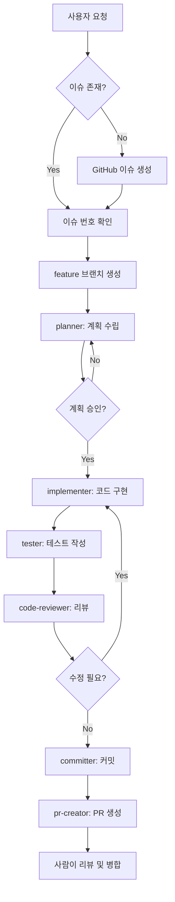

# 개발 워크플로우 (Workflows)

---
authority: canonical
---

**Ramap 프로젝트의 표준 개발 프로세스**

모든 기능 개발은 이 워크플로우를 따릅니다.

---

## 🎯 표준 워크플로우: 이슈 기반 개발



---

## 단계별 상세 설명

### Step 1: GitHub 이슈 생성

**목적**: 모든 작업을 추적 가능하게 만듭니다.

**실행**:
```bash
# AI가 자동으로 실행
gh issue create \
  --title "feat(map): add shop markers on map" \
  --body "사용자가 지도에서 라멘집 위치를 볼 수 있어야 합니다.\n\n## 요구사항\n- Kakao Map 통합\n- Shop 마커 표시\n- 마커 클릭 시 상세 정보" \
  --label "feature"
```

**이슈 제목 형식**:
```
<type>(<scope>): <description>

예시:
feat(map): add shop markers on map
fix(review): resolve image upload error
docs: update API guide
```

**라벨**:
- `feature`: 새 기능
- `bug`: 버그 수정
- `docs`: 문서 작업
- `refactor`: 리팩토링
- `test`: 테스트 추가
- `chore`: 기타 작업

**출력**:
```
Created issue #42: feat(map): add shop markers on map
https://github.com/chanho0908/Ramap/issues/42
```

---

### Step 2: Feature 브랜치 생성

**목적**: develop 브랜치를 보호하고 작업을 격리합니다.

**실행**:
```bash
# 최신 develop 가져오기
git checkout develop
git pull origin develop

# feature 브랜치 생성
git checkout -b feature/42-add-shop-markers
```

**브랜치 네이밍 규칙**:
```
feature/<issue-number>-<kebab-case-description>

예시:
feature/42-add-shop-markers
fix/43-review-image-upload
docs/44-update-api-guide
```

---

### Step 3: 계획 수립 (planner)

**담당**: `planner` Agent
**권한**: READ-ONLY

**실행 조건**:
- ✅ 범위가 큰 기능 (3개 이상 파일 수정)
- ✅ 아키텍처 영향이 있는 변경
- ✅ 불명확한 요구사항

**Skip 가능**:
- 파일 1-2개, 10줄 이하 수정
- 명확한 버그 수정
- 문서 업데이트

**계획 문서 형식**:
```markdown
## 구현 계획: 지도에 Shop 마커 표시

### 목표
사용자가 지도에서 주변 라멘집 위치를 볼 수 있습니다.

### Working Fence
#### 가정
- Kakao Map API 키 설정 완료
- Supabase shops 테이블에 데이터 존재
- 현재 위치 권한 허용

#### 단순성
- 첫 구현은 기본 마커만 표시
- 클러스터링은 추후 추가
- 필터링은 다음 단계

#### 변경 범위
1. `apps/web/app/map/page.tsx` (생성)
2. `apps/web/app/map/components/MapView.tsx` (생성)
3. `apps/web/app/map/components/ShopMarker.tsx` (생성)
4. `packages/shared/src/api/shops.ts` (수정)

#### 검증 기준
- [ ] 지도가 렌더링됨
- [ ] 현재 위치 중심으로 표시됨
- [ ] Shop 마커가 표시됨
- [ ] 마커 클릭 시 간단한 정보 표시
- [ ] 타입 에러 없음

### 구현 단계
1. Shop API 함수 추가 (`fetchNearbyShops`)
2. MapView 컴포넌트 생성 (Kakao Map 래핑)
3. ShopMarker 컴포넌트 생성
4. page.tsx에서 통합

### 테스트 전략
- `fetchNearbyShops`: 단위 테스트
- `MapView`: 컴포넌트 렌더링 테스트
- 통합: 데이터 흐름 E2E

### 예상 소요 시간
2-3시간
```

**사용자 승인**:
planner는 계획을 사용자에게 제시하고 승인을 기다립니다.

---

### Step 4: 코드 구현 (implementer)

**담당**: `implementer` Agent
**권한**: READ-WRITE

**실행**:
계획 승인 후 실제 코드를 작성합니다.

**코딩 원칙**:
1. **DRY**: 중복 코드 제거
2. **KISS**: 단순하게 유지
3. **YAGNI**: 필요한 것만 구현

**체크리스트**:
- [ ] TypeScript strict mode 준수
- [ ] 명시적 타입 정의
- [ ] Props 인터페이스 정의
- [ ] 에러 처리 포함
- [ ] console.log 제거

**실행 예시**:
```bash
# 1. Shop API 함수 추가
# packages/shared/src/api/shops.ts

# 2. MapView 컴포넌트 생성
# apps/web/app/map/components/MapView.tsx

# 3. ShopMarker 컴포넌트 생성
# apps/web/app/map/components/ShopMarker.tsx

# 4. page.tsx 생성
# apps/web/app/map/page.tsx

# 5. 타입 체크
pnpm type-check

# 6. 로컬 테스트
pnpm dev:web
```

---

### Step 5: 테스트 작성 (tester)

**담당**: `tester` Agent

**테스트 레벨**:
1. **단위 테스트**: API 함수, 유틸리티
2. **컴포넌트 테스트**: UI 컴포넌트
3. **통합 테스트**: 데이터 흐름

**예시**:
```typescript
// packages/shared/src/api/shops.test.ts
describe('fetchNearbyShops', () => {
  it('should fetch shops within radius', async () => {
    const shops = await fetchNearbyShops({
      lat: 37.5,
      lng: 127.0,
      radius: 5
    });

    expect(shops).toBeDefined();
    expect(shops.length).toBeGreaterThan(0);
  });
});

// apps/web/app/map/components/ShopMarker.test.tsx
describe('ShopMarker', () => {
  it('renders shop name', () => {
    const shop = { id: '1', name: '라멘집', lat: 37.5, lng: 127.0 };
    render(<ShopMarker shop={shop} />);

    expect(screen.getByText('라멘집')).toBeInTheDocument();
  });
});
```

**실행**:
```bash
pnpm test
```

---

### Step 6: 코드 리뷰 (code-reviewer)

**담당**: `code-reviewer` Agent (선택적)
**권한**: READ-ONLY

**체크 항목**:
- 코딩 컨벤션 준수
- 타입 안정성
- 에러 처리
- 성능 이슈
- 보안 취약점

**출력**:
```markdown
## 리뷰 의견

### ✅ 잘된 점
- TypeScript 타입 명시적 정의
- 에러 핸들링 포함

### ⚠️ 개선 제안
1. `MapView.tsx:42`: 마커 클릭 핸들러에 에러 바운더리 추가
2. `shops.ts:28`: API 호출 타임아웃 설정 (10초)

### 🔧 필수 수정
- 없음
```

---

### Step 7: 커밋 (committer)

**담당**: `committer` Agent

**실행 조건**:
- 사용자 명시적 요청: "커밋해줘"
- 구현 + 테스트 완료

**커밋 메시지 형식** (한국어):
```
<type>(<scope>): <한국어 제목>

<한국어 본문>

Closes #<이슈번호>

🤖 Generated with [Claude Code](https://claude.com/claude-code)

Co-Authored-By: Claude <noreply@anthropic.com>
```

**예시**:
```bash
git commit -m "$(cat <<'EOF'
feat(map): 지도에 라멘집 마커 표시 기능 추가

- Kakao Map SDK 통합
- fetchNearbyShops API 함수 추가
- MapView, ShopMarker 컴포넌트 생성
- 마커 클릭 시 Shop 이름 표시

Closes #42

🤖 Generated with [Claude Code](https://claude.com/claude-code)

Co-Authored-By: Claude <noreply@anthropic.com>
EOF
)"
```

**중요**: Type과 Scope는 영어, Subject와 Body는 **한국어**로 작성합니다.

**실행**:
```bash
# 변경 파일 확인
git status

# 스테이징
git add apps/web/app/map/ packages/shared/src/api/shops.ts

# 커밋
git commit -m "..."

# 확인
git log -1
```

---

### Step 8: PR 생성 (pr-creator)

**담당**: `pr-creator` Agent

**실행 조건**:
- 사용자 명시적 요청: "PR 만들어줘"
- 커밋 완료

**실행**:
```bash
# 원격 푸시
git push -u origin feature/42-add-shop-markers

# Draft PR 생성
gh pr create \
  --base develop \
  --head feature/42-add-shop-markers \
  --title "feat(map): add shop markers on map" \
  --body "$(cat <<'EOF'
## 변경 사항
- Kakao Map SDK 통합
- Shop 마커 표시 기능
- 마커 클릭 시 상세 정보

## 테스트
- [x] 로컬 테스트 완료
- [x] 타입 에러 없음
- [x] 지도 렌더링 정상
- [x] 마커 표시 확인

## 스크린샷
[추가 예정]

## 체크리스트
- [x] 코딩 컨벤션 준수
- [x] 테스트 작성 완료
- [x] console.log 제거
- [x] 타입 에러 없음

## 관련 이슈
Closes #42

🤖 Generated with [Claude Code](https://claude.com/claude-code)
EOF
)" \
  --draft
```

**출력**:
```
Created draft pull request #43
https://github.com/chanho0908/Ramap/pull/43
```

---

### Step 9: 최종 리뷰 및 병합

**담당**: 사람 (필수)

**절차**:
1. GitHub PR 페이지 접속
2. 변경사항 검토
3. 필요시 추가 수정 요청
4. "Ready for review" 전환
5. Approve
6. Merge to develop

**병합 옵션**:
- ✅ **Squash and merge**: 권장 (커밋 히스토리 정리)
- Create a merge commit: 커밋 보존 필요시
- Rebase and merge: 선형 히스토리

---

## 🚀 빠른 작업 (작은 수정)

**조건**:
- 파일 1-2개, 10줄 이하
- 명확한 버그 수정
- 오타 수정

**간소화 가능**:
- ✅ 이슈 생략 가능
- ✅ planner 생략 가능
- ❌ 커밋/PR 승인은 필수

**예시**:
```
사용자: "README 오타 수정해줘"

워크플로우:
1. implementer: README 수정
2. committer: 커밋
3. pr-creator: PR 생성 (또는 직접 develop 푸시)
```

---

## 📊 워크플로우 패턴별 요약

### 패턴 1: 새 기능 (Full Workflow)
```
이슈 → 브랜치 → planner → implementer → tester → committer → PR → 병합
```

### 패턴 2: 버그 수정
```
이슈 → 브랜치 → implementer → tester → committer → PR → 병합
(planner 생략 가능)
```

### 패턴 3: 문서 업데이트
```
(이슈 생략) → 브랜치 → writer → committer → PR → 병합
```

### 패턴 4: 급한 수정 (Hotfix)
```
이슈 → hotfix 브랜치 → implementer → committer → PR → main & develop 병합
```

---

## 🔧 트러블슈팅

### Q: 계획과 실제 구현이 달라졌어요
**A**: 정상입니다. 구현 중 발견한 사항을 커밋 메시지에 명시하세요.

### Q: 테스트가 실패해요
**A**: implementer로 돌아가 수정 후 다시 tester 실행

### Q: PR이 충돌나요
**A**:
```bash
git checkout develop
git pull origin develop
git checkout feature/42-add-shop-markers
git merge develop
# 충돌 해결
git push
```

---

**최종 업데이트**: 2026-06-16
**버전**: 1.0.0
